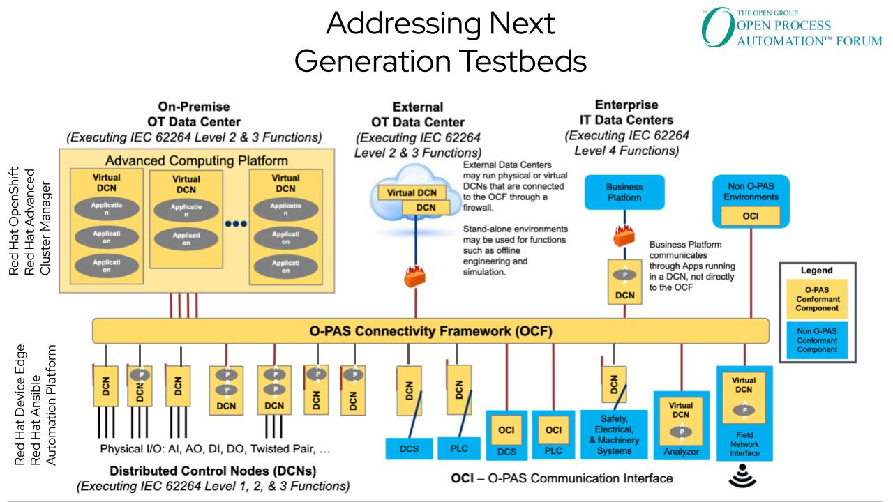

# Advanced Computing Platform Deployment Automation
This repository is designed to help the deployment of ACPs via automation, and to be a general reference for deployment. The idea is that anyone with some knowledge of OCP should be able to leverage this repository to build an ACP.

This respository is very much a work in progress, and represents an opinionated view on how to build an ACP. Feedback and contributions are welcome.

## Terminology
- ACP: **A**dvanced **C**omputing **P**latform, a component of the [OPAF](https://www.opengroup.org/forum/open-process-automation-forum) architecture
- Testbed: An implimentation of an ACP to be used for testing and evaluation of industrial/realtime workloads
- DCN: **D**istributed **C**ontrol **N**ode, a small, purpose built device, also part of the [OPAF](https://www.opengroup.org/forum/open-process-automation-forum) architecture, outside of the scope of this repository, except for the management pieces which will run on an ACP

## OPAF Architecture


> **Note **
>
>  Our scope is the ‘Advanced Computing Platform’, located in the top left of this slide.

## Highly Available vs. Non-Highly Available Architectures
ACPs will come in two flavors: highly available and non highly available. HA implementations will leverage 3-node OpenShift, non-HA implementations will leverage single node OpenShift.

In addition, a large implementation will be included later, which will separate the control and compute planes, however this is out of scope for now.


## Hardware Recommendations
These are hardware recommendations, ensure you scale up based on application load, and down if there are compute/cooling constraints.

### Highly Available Hardware Recommendations
3 x OCP-certified servers (Dell/HPE/Lenovo/Supermicro/OnLogic/Advantech/etc)

```
1+ Socket(s)/8+ cores [1]
32GB+ RAM
3+ SSDs:
- 1 x /sysroot
- 2+ JBOD/Passthrough ODF
2+ NVMe:
- 1 x etcd
- 1+ /var/lib/containers, /var/lib/kubernetes
4+ 10Gbe NICs [2][3]
- Pair for ODF traffic via Multus
- 1 x cluster provisioning/APIs (OOB management)
- 1 x specific application traffic/fieldnet connection
1 1Gbe Out-of-band/BMC connection

[1] Be sure to meet minimum requirements for ODF
[2] Networks can be logically or physically segmented, the above is a general recommendation - evaluate failure requirements
[3] 2 NICs minimum, 4 preferred, scale up as needed by workloads/segmentation
[4] These are production recommendations, POCs/testing can be done with less hardware, but don’t “starve” OCP or your experience will be compromised
```

### Non-Highly Available Hardware Recommendations
TO-DO

## General Installation Procedure
1. Setup DNS
    * External DNS is perferred, ensure the appropriate [DNS](https://docs.openshift.com/container-platform/4.13/installing/installing_platform_agnostic/installing-platform-agnostic.html#installation-dns-user-infra_installing-platform-agnostic) configuration is performed
    * For testing/example processes, a DNS playbook is provided that creates a container with BIND to serve DNS
2. Setup DHCP
    * This step is **optional**, static IP addresses can be assigned during install
3. Setup [oc-mirror](https://docs.openshift.com/container-platform/4.13/installing/disconnected_install/installing-mirroring-disconnected.html#installing-mirroring-disconnected)
    * This step is **optional**, being used for disconnected installs
    * To-do: create `oc-mirror` automation
4. Create installation media
    * The [agent installer](https://docs.openshift.com/container-platform/4.13/installing/installing_with_agent_based_installer/preparing-to-install-with-agent-based-installer.html) is used in this repo to avoid needing a bootstrap node
    * The installation media can be written to a USB flash drive and booted from
    * Network based installation methods will be addressed in the future
5. Install Red Hat OpenShift
    * Generally takes 20-120 minutes, depending on hardware and connectivity
    * `oc get co -w` can be used to monitor cluster installation progress
    * To troubleshoot installation issues, review [this page](https://docs.openshift.com/container-platform/4.13/support/troubleshooting/troubleshooting-installations.html)
6. Deploy [OpenShift Data Foundation](https://access.redhat.com/documentation/en-us/red_hat_openshift_data_foundation/4.13/html/deploying_openshift_data_foundation_using_bare_metal_infrastructure/index)
7. Deploy [OpenShift Pipelines](https://docs.openshift.com/container-platform/4.13/cicd/pipelines/understanding-openshift-pipelines.html)
8. Deploy [OpenShift Virtualization](https://docs.openshift.com/container-platform/4.13/virt/about-virt.html)
9. Deploy [Ansible Automation Platform](https://access.redhat.com/documentation/en-us/red_hat_ansible_automation_platform/2.4/html/deploying_the_red_hat_ansible_automation_platform_operator_on_openshift_container_platform/index)

## Automation Approach
Generally speaking, [Ansible](https://www.ansible.com/) is a approachable automation language that can be used to perform tasks against multiple types of targets, such as systems and kubernetes clusters.

## Automated Approach
1. Populate a vars file
    * An example vars file can be located [examples/extra-vars.yml](examples/extra-vars.yml)
2. Populate an inventory file
    * An example inventory file can be located at [examples/inventory.yml](https://www.ansible.com/)
3. Run the appropriate playbooks

> **Note**
>
> The 'helper' node is simply a system that can be used to generate installation media and, if desired, host mirrored content from `oc-mirror`. It can be a laptop, small form-factor device, etc.
